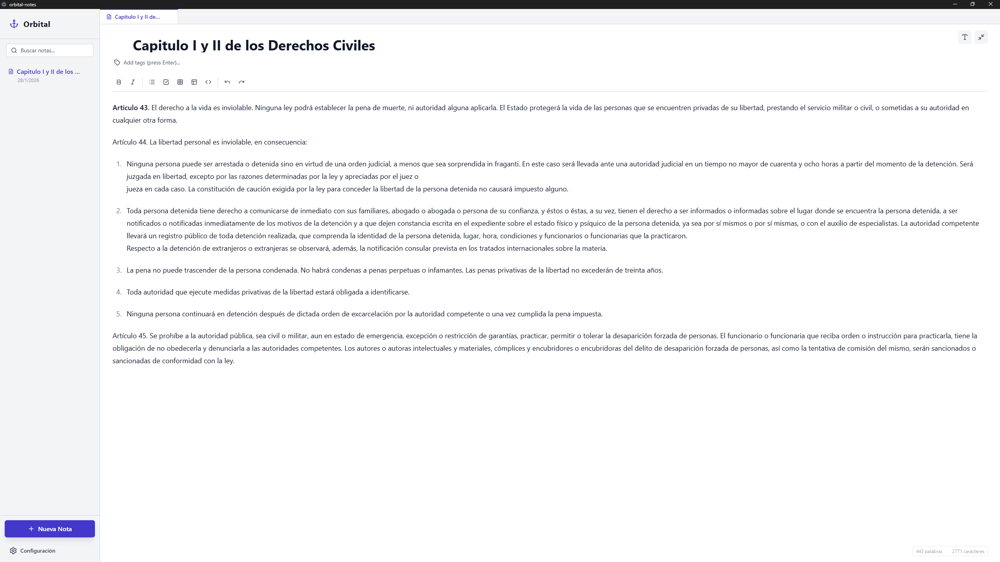
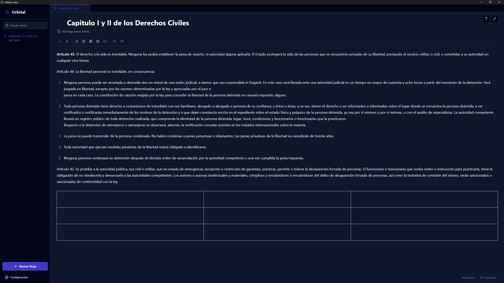

# Orbital Notas

[-v1.0.0-success?style=for-the-badge&logo=windows)](https://github.com/luisalgomez111/orbital-notes/releases/tag/v1.0.0)

Una aplicación de escritorio moderna y elegante para la gestión de notas, construida con las últimas tecnologías web.

## 🚀 Características

- **Gestión de Notas**: Crea, edita y organiza tus notas de manera eficiente.
- **Interfaz Moderna**: Diseño limpio y minimalista para una mejor experiencia de usuario.
- **Rendimiento**: Optimizada para ser rápida y ligera.
- **Multiplataforma**: Funciona en Windows (y adaptable a otros sistemas operativos).

## 📸 Galería

<p align="center">
  
  
  
</p>

## 📥 Descarga

Puedes descargar la última versión para Windows aquí:
[](https://github.com/luisalgomez111/orbital-notes/releases/tag/v1.0.0)

---

## 🛠️ Tecnologías Utilizadas

Este proyecto utiliza un stack tecnológico robusto y moderno:

- **[Electron](https://www.electronjs.org/)**: Para la creación de la aplicación de escritorio.
- **[React](https://reactjs.org/)**: Librería para la interfaz de usuario.
- **[TypeScript](https://www.typescriptlang.org/)**: Para un código más seguro y escalable.
- **[Vite](https://vitejs.dev/)**: Entorno de desarrollo ultrarrápido.
- **[TailwindCSS](https://tailwindcss.com/)**: Para estilos y diseño responsivo.

## 💻 Instalación y Uso Local

Sigue estos pasos para ejecutar la aplicación en tu computadora:

1. **Clonar el repositorio**:
   ```bash
   git clone https://github.com/luisalgomez111/orbital-notes.git
   cd orbital-notes
   ```

2. **Instalar dependencias**:
   ```bash
   npm install
   ```

3. **Ejecutar en modo desarrollo**:
   ```bash
   npm run dev
   ```

## 📦 Construcción (Build)

Para generar el instalador o ejecutable de la aplicación:

```bash
npm run build
```

## 🤝 Contribución

¡Las contribuciones son bienvenidas! Si tienes ideas para mejorar Orbital Notas, no dudes en abrir un *issue* o enviar un *pull request*.

## 📄 Licencia

Este proyecto está bajo la Licencia [MIT](LICENSE).

## ☕ Apóyame

Si te gusta este proyecto y quieres apoyar su desarrollo, puedes invitarme un café:

[](https://www.paypal.com/paypalme/LGomez1991)

**Binance**: `luisalbertogomez111@gmail.com`


